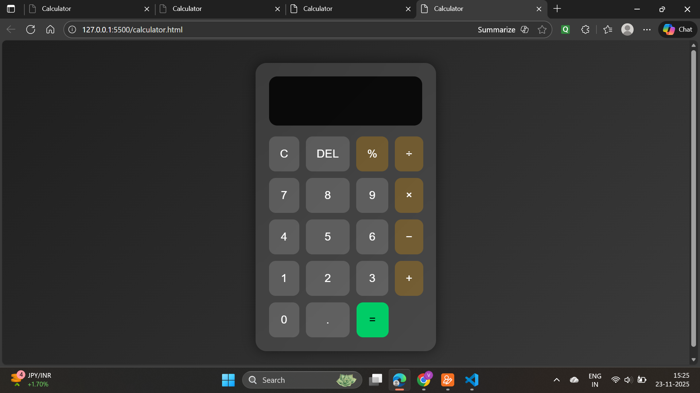
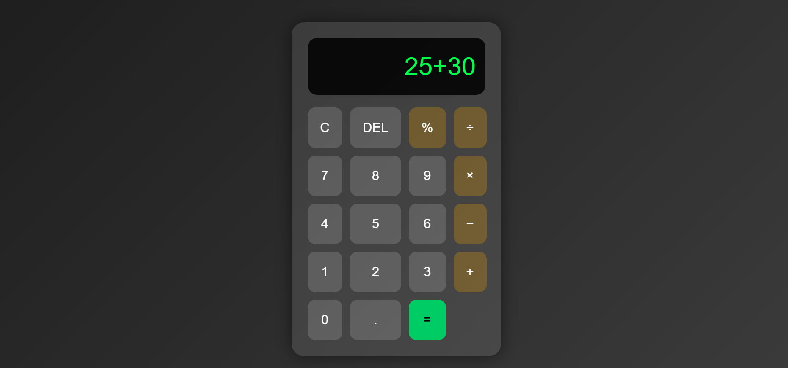
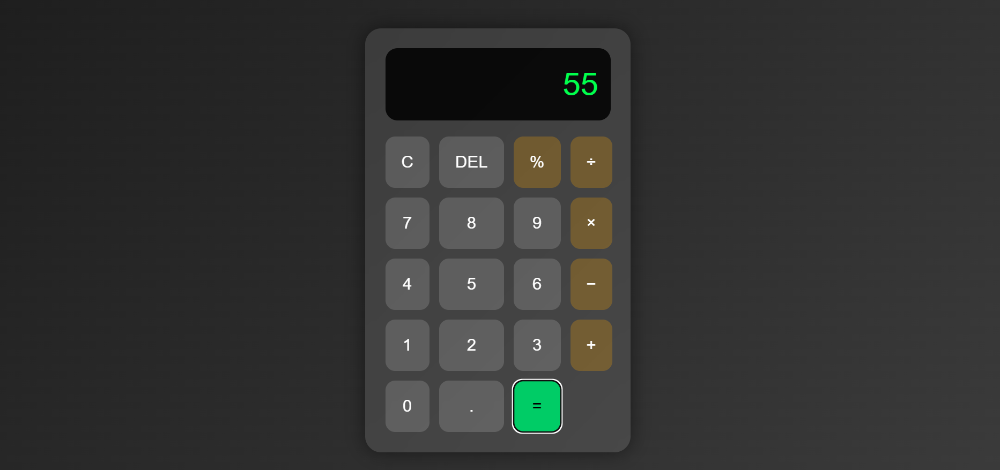

Calculator Web Application
A simple and fully functional calculator built using HTML, CSS, and JavaScript.
It performs basic arithmetic operations including Addition, Subtraction, Multiplication, and Division

🚀 Features
✔ Clean and responsive UI
✔ Works just like a real calculator
✔ Live display update while typing
✔ Handles keyboard as well as button press 

📸 Screenshot
Below is the working interface of the Calculator 👇  

🔢 Working
The calculator supports:
Operation
Symbol
Addition (+)
Subtraction (-)
Multiplication (×)
Division (÷)
Clear All (C)
Delete Last (DEL)
Result (=)

Working Example
Input

Output

💡 Future Improvements 
Dark / Light mode
Scientific calculator mode
Sound effects for buttons

👩‍💻 Developer
Designed & Developed by Varshita Tawade
23 November 2025
